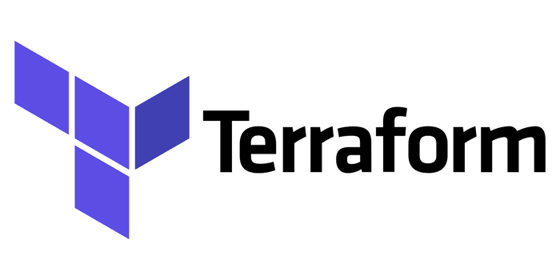

# Terraform-Argocd
## Creating argocd resources using terraform

## what kind of resources are we going to create:
- Argocd applications
   - without sync policies & sync options :white_check_mark:
   - with sync policies & sync options :white_check_mark:
- Argocd projects :white_check_mark:
- Argocd private repositories :white_check_mark:
- Argocd clusters :white_check_mark:
- Argocd applicationsets
   - cluster generator :white_large_square:
   - list generator :white_large_square:
   - git generator (directories subtype) :white_large_square:
   - git generator (files subtype) :white_large_square:
   - matrix generator :white_large_square:
   - merge generator :white_large_square:
